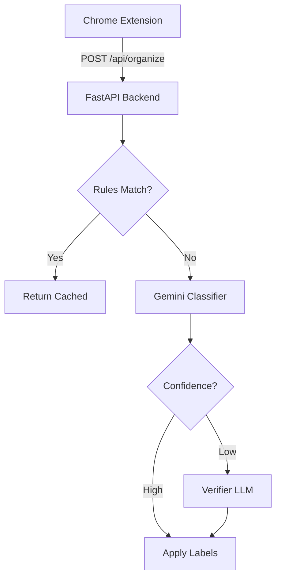
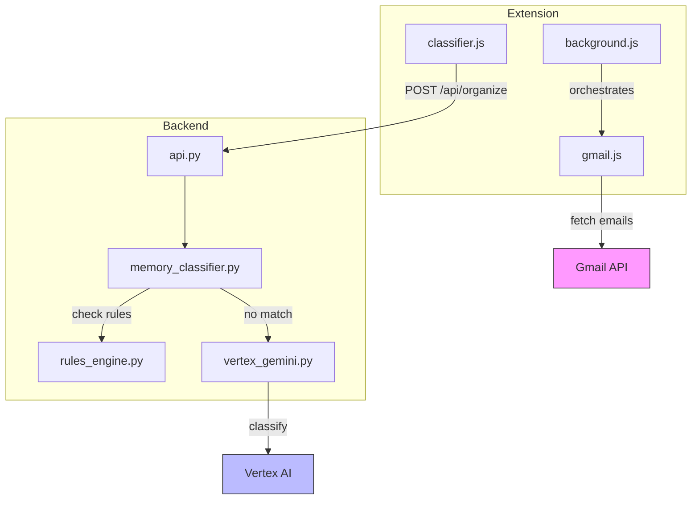
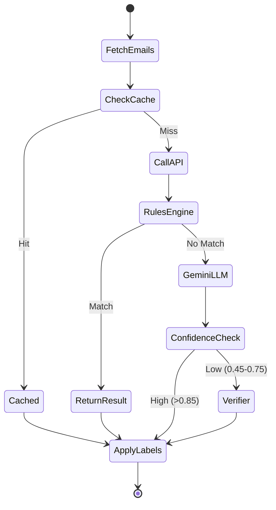

# Code-Graph v2 Upgrade Plan

Transform code-graph from "auto-generated file list" to **"living visual documentation system"**.

## 🎯 Goals

1. **Visual-First**: Diagrams explain better than text
2. **Human-Readable**: Clear explanations, not AI jargon
3. **Up-to-Date**: Quick regeneration (seconds, not minutes)
4. **Complementary**: Works with curated docs, doesn't replace them
5. **Interactive**: Clickable, explorable diagrams

## 🔄 Current vs Future

### Current State (v1)
```
❌ Static file-by-file analysis
❌ Generic AI summaries ("This file provides...")
❌ Slow regeneration (calls Gemini for every file)
❌ Redundant with curated docs
❌ Text-heavy, few visuals
```

### Future State (v2)
```
✅ Visual data flow diagrams
✅ Specific, actionable explanations
✅ Fast incremental updates (only changed files)
✅ Complements curated docs (different purpose)
✅ Interactive Mermaid diagrams
```

## 📊 What to Generate

### 1. Visual System Architecture
**Output**: `visuals/SYSTEM_DIAGRAM.md`



**Features**:
- Auto-generated from code analysis
- Clickable nodes link to file references
- Shows data flow with actual function names

### 2. Component Interaction Map
**Output**: `visuals/COMPONENT_MAP.md`

Shows which files call which, with:
- Call frequency (from import analysis)
- Data passed between components
- Critical paths highlighted

### 3. Classification Flow Diagram
**Output**: `visuals/CLASSIFICATION_FLOW.md`

Step-by-step visualization:
```
Email Input
  ↓ [gmail.js:fetchUnlabeledEmails()]
Cache Check
  ↓ [cache.js:get()]
API Call
  ↓ [classifier.js:classifyEmails()]
Backend Processing
  ↓ [memory_classifier.py:classify()]
...
```

### 4. "How It Works" Explanations
**Output**: `explanations/HOW_IT_WORKS.md`

Not "what files exist" but "how the system achieves X":
- How does classification work?
- How does learning from feedback work?
- How does the verifier decide to challenge?
- How are labels cached?

### 5. Quick Reference Cards
**Output**: `quick-ref/`

One-page summaries:
- **API Endpoints** - Request/response examples
- **Extension Modules** - What each does in 3 sentences
- **Backend Flow** - From email → label in 10 steps
- **Cost Breakdown** - What operations cost what

### 6. Change Impact Analysis
**Output**: `analysis/IMPACT_MAP.md`

"If I change X, what breaks?"
```
api.py
  ↓ Called by: extension/modules/classifier.js
  ↓ Affects: All email classification
  ↓ Tests: shopq/tests/test_api.py (15 tests)
  ↓ Impact: HIGH - Core functionality
```

## 🛠️ Technical Implementation

### Phase 1: Core Infrastructure
```python
# scripts/analyzer.py
class CodeGraphV2:
    def __init__(self):
        self.graph = DependencyGraph()
        self.cache = FileCache()  # Only regenerate changed files

    def analyze_incremental(self):
        """Only analyze files changed since last run"""
        changed = self.get_changed_files()
        for file in changed:
            self.analyze_file(file)

    def generate_diagrams(self):
        """Generate Mermaid diagrams from code analysis"""
        return [
            self.generate_system_diagram(),
            self.generate_component_map(),
            self.generate_flow_diagram()
        ]
```

### Phase 2: Better AI Summaries
```python
# Improved prompts
SYSTEM_PROMPT = """
You are a technical documentation expert. Explain this code component in:
1. ONE sentence: What it does
2. THREE bullet points: How it works
3. ONE example: Real-world usage

Focus on BEHAVIOR, not structure. Use specific examples from the code.

BAD: "This file provides utility functions for classification."
GOOD: "Deduplicates emails by sender domain before API calls, reducing
       costs by 70% (e.g., 100 Amazon emails → 1 API call)."
"""
```

### Phase 3: Visual Generation
```python
def generate_mermaid_diagram(component_data):
    """Convert code analysis to Mermaid diagram"""
    diagram = "flowchart TB\n"

    # Add nodes
    for component in component_data:
        diagram += f"    {component.id}[{component.name}]\n"

    # Add edges with labels
    for edge in component_data.edges:
        diagram += f"    {edge.from} -->|{edge.label}| {edge.to}\n"

    return diagram
```

### Phase 4: Integration with Docs
```markdown
<!-- In docs/ARCHITECTURE.md -->
## Visual Overview

See auto-generated diagrams:
- [System Architecture](../code-graph/visuals/SYSTEM_DIAGRAM.md)
- [Component Interactions](../code-graph/visuals/COMPONENT_MAP.md)
- [Classification Flow](../code-graph/visuals/CLASSIFICATION_FLOW.md)

> ⚡ These diagrams auto-update when code changes. Run `make docs` to regenerate.
```

## 📁 New Directory Structure

```
code-graph/
├── README.md                      # Quick start guide
├── UPGRADE_PLAN.md               # This file
│
├── scripts/                       # Generation tools
│   ├── analyze.py                # Main analyzer (improved)
│   ├── diagram_generator.py      # Mermaid diagram creator
│   ├── explainer.py              # AI-powered explanations
│   └── quick_regen.sh            # Fast incremental update
│
├── visuals/                       # Auto-generated diagrams
│   ├── SYSTEM_DIAGRAM.md         # Overall architecture
│   ├── COMPONENT_MAP.md          # Module interactions
│   ├── CLASSIFICATION_FLOW.md    # Email → Label flow
│   ├── DATA_FLOW.md              # Data movement
│   └── COST_BREAKDOWN.md         # Operations cost diagram
│
├── explanations/                  # "How it works" guides
│   ├── HOW_IT_WORKS.md           # System-level explanation
│   ├── CLASSIFICATION.md         # Classification deep-dive
│   ├── LEARNING.md               # Feedback loop explanation
│   └── CACHING.md                # Cache strategy explanation
│
├── quick-ref/                     # One-page references
│   ├── API.md                    # Endpoint quick ref
│   ├── MODULES.md                # Module cheat sheet
│   ├── COSTS.md                  # Cost calculator
│   └── DEBUGGING.md              # Common issues
│
└── analysis/                      # Technical analysis
    ├── DEPENDENCIES.md           # Dependency graph
    ├── IMPACT_MAP.md             # Change impact analysis
    └── STATS.md                  # Code statistics
```

## 🚀 Usage Workflow

### Developer Onboarding
```bash
# New developer wants to understand the system
cd code-graph
open visuals/SYSTEM_DIAGRAM.md    # See architecture
open explanations/HOW_IT_WORKS.md # Understand flow
open quick-ref/MODULES.md         # Quick reference
```

### After Code Change
```bash
# Auto-regenerate affected diagrams
./scripts/quick_regen.sh

# Shows:
# ✅ Updated CLASSIFICATION_FLOW.md (classifier.py changed)
# ✅ Updated COMPONENT_MAP.md (new import detected)
# ⏭️  Skipped SYSTEM_DIAGRAM.md (no architecture changes)
```

### Before Making Changes
```bash
# Check impact
grep "api.py" analysis/IMPACT_MAP.md

# Shows:
# 📍 api.py
#   Called by: extension/modules/classifier.js (47 times/day)
#   Affects: All email classification
#   Tests: shopq/tests/test_api.py (15 tests)
#   Impact: HIGH ⚠️
```

## 🎨 Visual Examples

### Example 1: System Diagram (Auto-Generated)



**Caption**: *Auto-generated from import analysis. Click nodes for source code.*

### Example 2: Classification Flow (Simplified)



**Caption**: *Shows decision points with actual confidence thresholds from code.*

## 🔧 Implementation Plan

### Week 1: Core Infrastructure
- [ ] Refactor analyzer.py for incremental updates
- [ ] Add file change detection (git diff)
- [ ] Create caching layer for analysis results
- [ ] Write tests for analyzer

### Week 2: Diagram Generation
- [ ] Implement Mermaid diagram generator
- [ ] Create system architecture diagram
- [ ] Create component interaction map
- [ ] Create classification flow diagram
- [ ] Add data flow visualization

### Week 3: Better Explanations
- [ ] Improve AI prompts (specific, actionable)
- [ ] Generate "How It Works" explanations
- [ ] Create quick reference cards
- [ ] Add real-world examples from code

### Week 4: Integration & Polish
- [ ] Integrate with curated docs (links)
- [ ] Create quick regeneration script
- [ ] Add impact analysis
- [ ] Write usage documentation
- [ ] Test with fresh developer

## 📊 Success Metrics

### Before (v1)
- ❌ Takes 5+ minutes to understand system (reading text)
- ❌ Regeneration takes 2+ minutes (Gemini API calls)
- ❌ Generic summaries ("This file provides...")
- ❌ No visual diagrams

### After (v2)
- ✅ Takes 30 seconds to understand system (visual diagram)
- ✅ Regeneration takes <10 seconds (incremental)
- ✅ Specific explanations ("Reduces costs 70% by deduplicating")
- ✅ Interactive Mermaid diagrams with clickable nodes

## 🎯 Differentiation from Curated Docs

| Purpose | Curated Docs | code-graph v2 |
|---------|--------------|---------------|
| **What** | Architecture, concepts, guides | Visual diagrams, auto-updated |
| **When** | Learning, reference | Quick understanding, exploration |
| **How** | Manual curation | Auto-generated from code |
| **Depth** | Deep explanations | High-level overviews |
| **Update** | On major changes | Every commit (incremental) |

**Both are valuable!** Curated docs provide depth, code-graph provides breadth and visuals.

## 🚦 Next Steps

1. **Review this plan** - Feedback? Changes?
2. **Prioritize features** - Which diagrams are most valuable?
3. **Execute Phase 1** - Build core infrastructure
4. **Iterate** - Generate first diagrams, get feedback
5. **Polish** - Improve based on usage

---

**Questions for Review**:
1. Which visual diagrams would be most helpful?
2. Should regeneration be automatic (git hook) or manual?
3. Focus on breadth (many diagrams) or depth (few perfect ones)?
4. Integration level with curated docs?
