# Auto-Organize Sequence

> **Manually maintained** - Last updated: 2025-12-04

## Overview

This diagram traces the end-to-end auto-organize flow, from the MV3 service worker alarm to Gmail labeling and digest triggers.

```mermaid
sequenceDiagram
    autonumber
    participant Alarm as ⏰ Chrome Alarm<br/>mailq-auto-organize
    participant Worker as 🎯 Background Service Worker
    participant Gmail as 📧 Gmail API
    participant Backend as 🐍 FastAPI / Pipeline
    participant Store as 🗂️ Chrome Storage
    participant Digest as 📬 Summary Pipeline

    Alarm->>Worker: Alarm fired (interval)
    Worker->>Store: Record session start
    Worker->>Worker: getAutoOrganizeSettings()
    Worker->>Gmail: Fetch unlabeled threads
    alt Threads found
        Worker->>Backend: POST /api/organize (batch)
        Backend->>Backend: Rules check to LLM to Importance to Labels
        Backend-->>Worker: Classification results
        Worker->>Gmail: Apply labels & archive
        Worker->>Store: Update cache + telemetry
        Worker->>Store: Set shopq_digest_pending=true
        par Digest Trigger
            Worker->>Digest: generateAndSendSummaryEmail()
            Digest->>Gmail: Send ShopQ digest
        end
    else Inbox empty
        Worker->>Store: Clear digest pending flag
    end
    Worker->>Store: Update shopq_last_auto_organize_at
```

## Execution Flow

1. **Alarm fires** based on the configured interval (`shopq_auto_organize_settings.intervalMinutes`).
2. **Service worker** validates settings, records session start, and queries Gmail for unlabeled threads.
3. **When threads exist**:
   - Calls the backend `/api/organize` endpoint with deduplicated threads.
   - Applies Gmail labels/archives via `gmail.js`.
   - Marks `shopq_digest_pending` so the next foreground Gmail tab triggers a digest.
4. **When inbox is empty**, the digest pending flag is cleared.
5. **Digest pipeline** runs when Gmail becomes active, using `generateAndSendSummaryEmail` to send the context digest.

## Key Metrics

- Alarm interval & settings in `shopq_auto_organize_settings`
- Cache hit/miss (`extension/modules/telemetry.js`)
- Pipeline timing (`infra/telemetry.py`:
  `pipeline.total_ms`, `gmail.fetch.latency_ms`, etc.)
- Digest timestamps (`shopq_last_digest_sent_at` sync storage)

---

**See also**:
- [System Storyboard](SYSTEM_STORYBOARD.md) – Architecture overview
- [Classification Flow](CLASSIFICATION_FLOW.md) – Backend classification steps
- [Digest Generation](TASK_FLOW_DIGEST.md) – Digest pipeline details

**Key files**:
- `extension/background.js` – Service worker
- `extension/modules/auto-organize.js` – Auto-organize logic
- `shopq/api/routes/organize.py` – Backend endpoint
