# Task-Flow: Email Classification

> **Manually maintained** - Last updated: 2025-12-04

## Overview

This diagram shows what happens when an email is classified, from user trigger to Gmail labels.

```mermaid
sequenceDiagram
    autonumber
    participant User as 👤 User
    participant Ext as 📱 Extension<br/>background.js
    participant Cache as 💾 Cache<br/>storage/cache.js
    participant API as 🌐 /api/organize
    participant Rules as 📋 Rules Engine<br/>classification/rules_engine.py
    participant LLM as 🤖 gemini-2.0-flash<br/>classification/vertex_gemini_classifier.py
    participant Import as 📊 Importance Classifier<br/>classification/importance_mapping/
    participant Temporal as ⏰ Temporal Decay<br/>classification/temporal.py
    participant Mapper as 🏷️ Label Mapper<br/>classification/mapper.py
    participant Gmail as 📧 Gmail API

    User->>Ext: Click MailQ icon / Auto-organize
    Ext->>Ext: Fetch unlabeled emails
    Ext->>Cache: Check sender cache (24hr TTL)

    alt Cache hit
        Cache-->>Ext: Return cached labels
        Ext->>Gmail: Apply labels & archive
    else Cache miss
        Ext->>Ext: Deduplicate by sender
        Note over Ext: 100 emails to ~30 unique

        Ext->>API: POST /api/organize (batch)
        API->>Rules: Check rules engine (rules table)

        alt Rules match (50-70% of emails)
            Rules-->>API: Return classification
            Note over Rules: Cost $0
        else No rule match
            Rules->>LLM: Classify with LLM
            LLM->>LLM: Extract type, attention, domains
            LLM-->>Rules: Return classification
            Note over LLM: Cost ~$0.001/email
        end

        API->>Import: Classify importance
        Note over Import: critical / time_sensitive / routine
        Import-->>API: Return importance + reason

        API->>Temporal: Apply temporal decay
        Note over Temporal: Adjust by time distance
        Temporal-->>API: Decayed importance

        API->>Mapper: Map to Gmail labels
        Mapper-->>API: Return label decisions
        API-->>Ext: Classification results

        Ext->>Gmail: Apply labels & archive
        Ext->>Cache: Update cache (24hr)
        Ext->>Ext: Expand to same-sender emails
    end

    Gmail-->>User: Organized inbox

    opt User corrects label
        User->>Ext: Change label in Gmail
        Ext->>API: POST /api/feedback
        API->>Rules: Create new rule (conf=0.95)
        Note over Rules: System learns
    end
```

## Execution Flow

1. **Trigger**: User clicks MailQ icon or auto-organize alarm fires
2. **Cache check**: Extension checks 24-hour cache for sender classifications
3. **Deduplication**: 100 emails reduced to ~30 unique senders for API call
4. **Rules engine**: Checks learned rules first (50-70% match rate, $0 cost) from `rules` table
5. **LLM fallback**: If no rule matches, use gemini-2.0-flash classifier (~$0.001/email)
6. **Importance classification**: Classify as critical/time_sensitive/routine based on content signals
7. **Temporal decay**: Adjust importance based on time-distance from reference events
8. **Label mapping**: Mapper converts classification to Gmail labels
9. **Apply & cache**: Labels applied, results cached for 24hr, expanded to same-sender emails
10. **Learning loop**: User label corrections create new rules via /api/feedback

## Key Files

| Component | File Path |
|-----------|-----------|
| API Route | `mailq/api/routes/organize.py` |
| Pipeline Wrapper | `mailq/classification/pipeline_wrapper.py` |
| Rules Engine | `mailq/classification/rules_engine.py` |
| LLM Classifier | `mailq/classification/vertex_gemini_classifier.py` |
| Memory Classifier | `mailq/classification/memory_classifier.py` |
| Importance Mapper | `mailq/classification/importance_mapping/mapper.py` |
| Temporal Decay | `mailq/classification/temporal.py` |
| Label Mapper | `mailq/classification/mapper.py` |

## Key Metrics

| Metric | Value |
|--------|-------|
| Cache TTL | 24hr |
| Rules match rate | 50-70% (estimate) |
| LLM cost per email | ~$0.001 |
| Avg latency | 1-3s |
| Type confidence min | 0.70 |
| Label confidence min | 0.70 |

---

**See also**:
- [Auto-Organize Sequence](AUTO_ORGANIZE_SEQUENCE.md)
- [Digest Generation](TASK_FLOW_DIGEST.md)
- [System Storyboard](SYSTEM_STORYBOARD.md)
