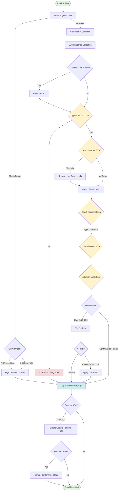

# Confidence System Flow

> **Manually maintained** - Last updated: 2025-12-04

> 📊 This diagram shows how confidence scores flow through the MailQ classification system and which gates filter low-confidence results.

## Overview

All confidence thresholds are centralized in **`config/mailq_policy.yaml`** and used throughout the system via the shared config module.

## Confidence Flow Diagram



## Confidence Gates Reference

### Gate 1: Type Confidence (Classification)
**Location**: `mailq/api/routes/organize.py`
```python
# From config/mailq_policy.yaml
type_confidence_min: 0.70

if result['type_conf'] < TYPE_CONFIDENCE_MIN:
    filtered_labels = ['Uncategorized']
```
- **Threshold**: 0.70 (70%)
- **Purpose**: Filter out uncertain type classifications
- **Action**: Mark as "Uncategorized" if below threshold
- **Why 0.70**: Balanced with verifier coverage (0.50-0.90) to catch edge cases

### Gate 2: Label Confidence (Classification)
**Location**: `mailq/api/routes/organize.py`
```python
# From config/mailq_policy.yaml
label_confidence_min: 0.70

filtered = [
    label for label in gmail_labels
    if gmail_labels_conf.get(label, 0.0) >= LABEL_CONFIDENCE_MIN
]
```
- **Threshold**: 0.70 (70%)
- **Purpose**: Filter individual labels (e.g., remove "MailQ-Finance" if only 60% confident)
- **Action**: Remove low-confidence labels
- **Why 0.70**: Consistent with type gate; verifier catches uncertain cases

### Gate 3: Mapper Gates (Label Application)
**Location**: `mailq/classification/mapper.py`
```python
# From config/mailq_policy.yaml
type_gate: 0.70
domain_gate: 0.70
attention_gate: 0.70

# Type gate
if result['type_conf'] >= TYPE_GATE:
    labels.append(type_label)

# Domain gate
if domain_conf >= DOMAIN_GATE:
    labels.append(domain_label)

# Attention gate
if result['attention_conf'] >= ATTENTION_GATE:
    labels.append('MailQ-Action-Required')
```
- **Type Gate**: 0.70 (matches Gate 1)
- **Domain Gate**: 0.70 (consistent across all gates)
- **Attention Gate**: 0.70 (consistent across all gates)

### Gate 4: Learning Gate
**Location**: `mailq/classification/memory_classifier.py`
```python
# From config/mailq_policy.yaml
learning_min_confidence: 0.70

if semantic_result['type_conf'] >= LEARNING_MIN_CONFIDENCE:
    self.rules.learn_from_classification(...)
```
- **Threshold**: 0.70
- **Purpose**: Only learn from confident LLM classifications
- **Action**: Create/update pending rules
- **Why 0.70**: Consistent with classification gates; verifier provides safety net

### Gate 5: Domain Boost (LLM Internal)
**Location**: `mailq/classification/vertex_gemini_classifier.py`
```python
# From config/mailq_policy.yaml
domain_min_threshold: 0.60
domain_boost_value: 0.70

if result['domain_conf'][domain] < DOMAIN_MIN_THRESHOLD:
    result['domain_conf'][domain] = DOMAIN_BOOST_VALUE
```
- **Min Threshold**: 0.60
- **Boost Value**: 0.70
- **Purpose**: Boost weak domain confidences that LLM declared but scored low
- **Why**: LLM often declares domains but underestimates confidence

### Gate 6: Verifier Triggers
**Location**: Backend verifier logic (config-driven)
```yaml
# From config/mailq_policy.yaml
verifier:
  trigger_conf_min: 0.50
  trigger_conf_max: 0.90

# Classification in [0.50, 0.90] triggers verifier
```
- **Low Bound**: 0.50
- **High Bound**: 0.90
- **Purpose**: Trigger second-pass LLM for classifications in uncertain range
- **Action**: Call `/api/verify` endpoint for second opinion
- **Why 0.50-0.90**: Wide range catches uncertain classifications; >0.90 trusted, <0.50 rejected

### Gate 7: Verifier Correction Acceptance
**Location**: Backend verifier logic
```yaml
# From config/mailq_policy.yaml
verifier:
  correction_delta: 0.15

# Accept correction if new_conf - old_conf >= 0.15
```
- **Threshold**: 0.15 (15 percentage points)
- **Purpose**: Only accept verifier corrections if significantly more confident
- **Why**: Prevent churn between similar confidences

## Confidence Logging

**Location**: `mailq/observability/confidence.py`

Every classification is logged to `confidence_logs` table:
```python
from mailq.observability.confidence import ConfidenceLogger

confidence_logger.log_classification(
    result={...},
    email_id=email.id,
    subject=email.subject,
    filtered_labels=stats['filtered_labels'],
    notes='low_confidence' if is_low_conf else None
)
```

**Logged Fields**:
- All confidence scores (type, domains, attention, relationship)
- Decider (rule/gemini/fallback)
- Filtered labels count
- Reason for classification
- Low-confidence flag

## Monitoring Endpoints

### Get All Thresholds
```bash
GET /api/config/confidence
```
Returns all centralized thresholds for frontend use.

### Get Confidence Stats
```bash
GET /api/confidence/stats?days=7
```
Returns aggregated statistics:
- Average confidence by decider
- Low confidence rate
- Filtered labels count
- By-type breakdown

### Get Low-Confidence Classifications
```bash
GET /api/confidence/low?limit=100
```
Returns recent low-confidence classifications for review.

### Get Confidence Trend
```bash
GET /api/confidence/trend?days=30
```
Returns time-series data for monitoring confidence over time.

## How to Adjust Thresholds

**All thresholds are in one place**: `config/mailq_policy.yaml`

To adjust:
1. Edit `config/mailq_policy.yaml`
2. Restart API server: `uvicorn mailq.api:app --reload`
3. Changes propagate automatically

**Example**: Make classification more strict
```yaml
# Before
confidence:
  type_confidence_min: 0.70

# After (more strict)
confidence:
  type_confidence_min: 0.85
```

## Design Philosophy

1. **Balanced Gates**: 0.70 threshold across all gates for consistency
2. **Wide Verifier Coverage**: 0.50-0.90 range ensures uncertain classifications get reviewed
3. **Consistent Learning**: Learn from same threshold as classification (0.70)
4. **Config-Driven**: All thresholds in `config/mailq_policy.yaml` for easy tuning
5. **Track Everything**: All confidence scores logged for analysis

## Future Improvements

- [ ] Auto-tune thresholds based on user feedback
- [ ] A/B test different threshold values
- [ ] Alert when low-confidence rate exceeds threshold
- [ ] Frontend dashboard showing confidence distribution
- [ ] Fetch thresholds from API in extension (remove hard-coded values)

---

**Configuration File**: `config/mailq_policy.yaml`
**See also**: [CLASSIFICATION_FLOW.md](CLASSIFICATION_FLOW.md) for end-to-end classification pipeline
