# MailQ System Storyboard

> **Manually maintained** - Last updated: 2025-12-04
>
> **Stats**: 98 backend files • 19 extension files • 4 API endpoints • 13 DB tables

> **Curated overview** of how MailQ captures, classifies, learns, and narrates.

## Overview

This storyboard highlights the five essential beats every MailQ run hits: **capture → classify → learn → narrate → delight**.

```mermaid
flowchart LR
    %% Client Layer
    subgraph client[" 1️⃣ CLIENT — Chrome Extension "]
        c1["🙋 User"]
        c2["Cache"]
        c3["Detectors"]
        c1 --> c2 --> c3
    end

    %% Gateway
    subgraph gateway[" 2️⃣ GATEWAY — FastAPI "]
        g1["Auth + Rate Limit"]
        g2["Router"]
        g1 --> g2
    end

    %% Classification Pipeline
    subgraph classify[" 3️⃣ CLASSIFY — Multi-Stage Pipeline "]
        p1["Rules Manager"]
        p2["Memory Classifier"]
        p3["LLM (gemini-2.0-flash)"]
        p4["Verifier"]
        p1 -->|miss| p2
        p2 -->|fallback| p3
        p3 --> p4
    end

    %% Temporal Intelligence
    subgraph enrich[" 4️⃣ ENRICH — Temporal Signals "]
        t1["Temporal Enrichment"]
        t2["Temporal Decay"]
        t1 --> t2
    end

    %% Database
    subgraph persist[" 5️⃣ PERSIST — Database "]
        d1[("mailq.db")]
        d2["13 tables"]
        d1 -.-> d2
    end

    %% Digest Generation
    subgraph narrate[" 6️⃣ NARRATE — Digest Builder "]
        n1["Entity Extractor"]
        n2["Importance Ranker"]
        n3["Narrative Builder"]
        n4["HTML Renderer"]
        n1 --> n2 --> n3 --> n4
    end

    %% Delivery & Feedback
    subgraph deliver[" 7️⃣ DELIVER — Send + Learn "]
        v1["📧 Send Email"]
        v2["📰 User Reads"]
        v3["👍👎 Feedback"]
        v4["Learn Rules"]
        v1 --> v2 --> v3 --> v4
    end

    %% Main Flow
    client -->|POST /api/organize| gateway
    gateway --> classify
    classify --> enrich
    enrich --> persist
    persist --> narrate
    narrate -->|POST /api/context-digest| deliver
    deliver -.->|/api/feedback| p1

    %% Observability (parallel)
    subgraph monitor[" 🔍 OBSERVABILITY "]
        o1["Telemetry"]
        o2["Quality Monitor"]
        o3["Bridge Logs"]
        o1 --> o2 --> o3
    end

    g2 -.-> o1
    p4 -.-> o1
    o3 -.->|feedback| p1

    %% Styling - Dark mode vibrant colors
    classDef clientStyle fill:#1e3a8a,stroke:#60a5fa,stroke-width:3px,color:#ffffff
    classDef gatewayStyle fill:#581c87,stroke:#c084fc,stroke-width:3px,color:#ffffff
    classDef classifyStyle fill:#92400e,stroke:#fbbf24,stroke-width:3px,color:#ffffff
    classDef enrichStyle fill:#14532d,stroke:#4ade80,stroke-width:3px,color:#ffffff
    classDef persistStyle fill:#164e63,stroke:#22d3ee,stroke-width:3px,color:#ffffff
    classDef narrateStyle fill:#831843,stroke:#f472b6,stroke-width:3px,color:#ffffff
    classDef deliverStyle fill:#4c1d95,stroke:#a78bfa,stroke-width:3px,color:#ffffff
    classDef monitorStyle fill:#7c2d12,stroke:#fb923c,stroke-width:3px,color:#ffffff

    class client clientStyle
    class gateway gatewayStyle
    class classify classifyStyle
    class enrich enrichStyle
    class persist persistStyle
    class narrate narrateStyle
    class deliver deliverStyle
    class monitor monitorStyle
```

## Story Beats (Detailed)

### 1. Capture (Chrome Extension → API)
**What happens:** User opens Gmail. Extension scans for unlabeled threads.
- **Cache check:** Reuse labels from `rules_cache` and `label_cache` (IndexedDB)
- **Pattern detectors:** Fast regex-based detection for newsletters, social, promos
- **Batch building:** Group unlabeled threads (max 50 per request)
- **API call:** POST to `/api/organize` with thread metadata (subject, snippet, sender, timestamp)

**Files:** `extension/background.js`, `extension/modules/auto-organize.js`, `extension/modules/cache.js`

### 2. Classify (Backend Pipeline)
**What happens:** Multi-stage classification with fallback chain.
- **Rules Manager:** Check user-defined rules and feedback-learned rules first (fastest, deterministic)
- **Memory Classifier:** Check learned patterns from previous sessions (medium speed, high confidence)
- **LLM Classifier:** Vertex AI `gemini-2.0-flash` with structured prompts (slowest, handles edge cases)
- **Verifier:** `NarrativeVerifier` checks for hallucinations (numbers, dates, names must exist in source)

**Files:** `mailq/api/routes/organize.py`, `mailq/classification/pipeline_wrapper.py`, `mailq/classification/rules_engine.py`, `mailq/classification/memory_classifier.py`, `mailq/classification/vertex_gemini_classifier.py`, `mailq/digest/narrative_verifier.py`

### 3. Learn (Temporal Intelligence + Persistence)
**What happens:** Enrich classifications with time-based signals and store decisions.
- **Temporal enrichment:** Add urgency signals (deadlines, event proximity, meeting times)
- **Temporal decay:** Apply time-based scoring (recent = higher priority)
- **Database write:** Store classification decision with metadata (decider, confidence, model version)
- **Feedback loop:** User corrections written to `feedback` table, trigger rule learning

**Files:** `mailq/classification/temporal.py`, `mailq/infrastructure/database.py`, `mailq/classification/feedback_learning.py`

### 4. Narrate (Digest Generation)
**What happens:** Build daily context-aware digest email.
- **Entity extraction:** Pull structured data (flights, events, deadlines, notifications) using rules + LLM
- **Importance ranking:** Classify as critical/time-sensitive/routine based on temporal signals
- **Narrative building:** Generate natural language story (~90 words) using context from entities
- **HTML rendering:** Render digest cards using Jinja2 template (`digest_v2.html.j2`)

**Files:** `mailq/digest/context_digest.py`, `mailq/digest/entity_extractor.py`, `mailq/digest/ranker.py`, `mailq/digest/narrative.py`, `mailq/digest/hybrid_digest_renderer.py`, `mailq/digest/templates/digest_v2.html.j2`

### 5. Delight (Delivery + Feedback)
**What happens:** Send digest, capture user feedback, improve system.
- **Digest delivery:** POST to `/api/context-digest`, returns HTML email sent via Gmail API
- **User interaction:** User reads digest, provides thumbs up/down on classifications
- **Feedback capture:** POST to `/api/feedback` with corrections (expected vs actual labels)
- **Rule learning:** `FeedbackManager` generates new rules or adjusts confidence thresholds
- **Quality monitoring:** Automated analysis flags hallucinations, inconsistencies, low-confidence decisions

**Files:** `mailq/api/routes/digest.py`, `mailq/api/routes/feedback.py`, `mailq/classification/feedback_learning.py`, `mailq/observability/quality_monitor.py`

## Touchpoints

### Database Schema (`mailq.db`)
Single SQLite database with 13 tables:
- `rules` – user rules + feedback-learned rules
- `pending_rules` – rules awaiting approval before activation
- `categories` – classification categories
- `feedback` – user corrections (label thumbs up/down)
- `learned_patterns` – patterns learned from feedback
- `corrections` – label corrections
- `digest_rules` – rules for digest generation
- `user_credentials` – OAuth credentials
- `confidence_logs` – classification confidence tracking
- `email_threads` – processed emails with classifications
- `digest_sessions` – digest generation metadata
- `ab_test_config` – A/B test configuration (pending)
- `digest_feedback` – user feedback on digests

### API Endpoints
- **`/api/organize`** – Main classification endpoint (batch processing)
  - Input: List of email metadata (subject, snippet, sender, timestamp)
  - Output: Classification results with labels, confidence, decider
- **`/api/feedback`** – User corrections and rule learning
  - Input: Email ID, expected label, actual label, feedback type
  - Output: Confirmation, new rule ID (if applicable)
- **`/api/context-digest`** – Timeline-centric digest generation
  - Input: Classified emails, timezone, user preferences
  - Output: HTML digest card with entities, narrative, metrics
- **`/api/verify`** – Secondary classification verification (optional)
  - Input: Email + first classification result
  - Output: Verification verdict (confirm/correct/flag)

### Observability & Quality Control
- **Telemetry:** `mailq/observability/telemetry.py` logs events (API calls, classifications, errors)
- **Confidence Logger:** `mailq/observability/confidence.py` tracks decision confidence over time
- **Quality Monitor:** `mailq/observability/quality_monitor.py` automated digest analysis
  - Runs LLM-based checks for hallucinations, inconsistencies, tone issues
  - Creates GitHub issues for quality problems
  - Stores results in `reports/quality/`
- **Structured Logging:** `mailq/observability/structured_logging.py` provides searchable event logs

### Feature Flags
- `USE_REFACTORED_PIPELINE` – Enable refactored classification pipeline (default: true)
- `MAILQ_USE_LLM` – Enable LLM fallback in classification (default: false, rules-only mode)
- Dynamic feature gates via `/api/feature-gates` (database-backed toggles)

## Maintenance

This file is **manually maintained**. Update when architecture changes.
