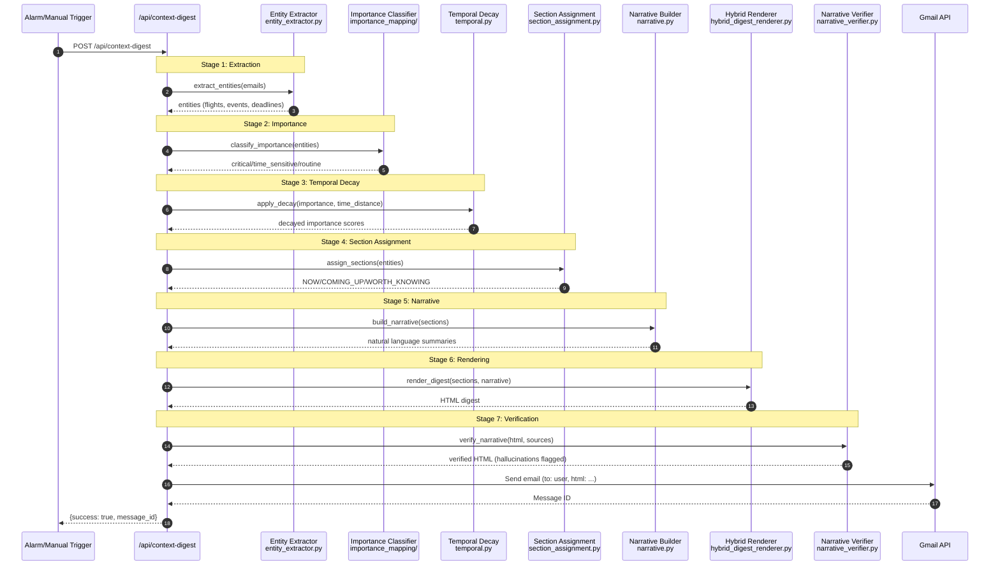

# Task-Flow Lens: Daily Digest Generation

> **Manually maintained** - Last updated: 2025-12-04

## Purpose

Answer: **"What happens when a daily digest is generated?"**

V2 7-stage pipeline from trigger to Gmail inbox.

## V2 Pipeline Stages

| Stage | Component | Purpose |
|-------|-----------|---------|
| 1. Extraction | `entity_extractor.py` | Extract structured entities from emails |
| 2. Importance | `importance_mapping/` | Classify as critical/time_sensitive/routine |
| 3. Temporal | `temporal.py` | Apply time-based decay to importance |
| 4. Section | `section_assignment.py` | Assign to NOW/COMING_UP/WORTH_KNOWING |
| 5. Narrative | `narrative.py` | Generate natural language summaries |
| 6. Rendering | `hybrid_digest_renderer.py` | Create HTML digest with cards |
| 7. Verification | `narrative_verifier.py` | Check for hallucinations |

## Key Files

| Component | File Path |
|-----------|-----------|
| API Route | `shopq/api/routes/digest.py` |
| Context Builder | `shopq/digest/context_digest.py` |
| Entity Extractor | `shopq/digest/entity_extractor.py` |
| Importance Mapper | `shopq/classification/importance_mapping/mapper.py` |
| Temporal Decay | `shopq/classification/temporal.py` |
| Section Assignment | `shopq/digest/section_assignment.py` |
| Narrative Builder | `shopq/digest/narrative.py` |
| Hybrid Renderer | `shopq/digest/hybrid_digest_renderer.py` |
| Narrative Verifier | `shopq/digest/narrative_verifier.py` |
| Template | `shopq/digest/templates/digest_v2.html.j2` |

## Metrics

- **Latency**: ~2-5s (depends on email volume)
- **LLM Cost**: ~$0.01/digest (narrative + verification)
- **Frequency**: Daily or on-demand

---

**See also**: [CLASSIFICATION_FLOW.md](CLASSIFICATION_FLOW.md) for classification before digest
