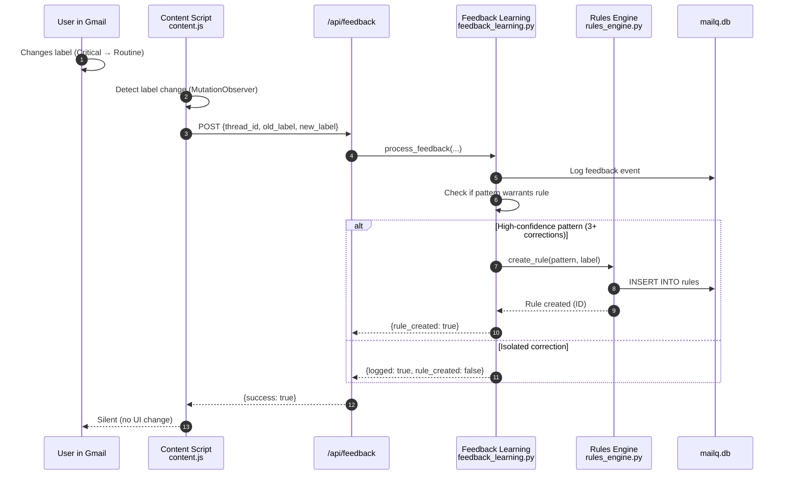

# Task-Flow Lens: Feedback Learning Loop

> **Manually maintained** - Last updated: 2025-12-04

## Purpose

Answer: **"What happens when a user corrects a label?"**

Max 8 steps, showing how feedback becomes a rule.

## Key Contracts

1. **Content → API**: `FeedbackEvent` with label change
2. **API → Feedback Manager**: Process correction
3. **Feedback → Rules Manager**: Create rule if warranted
4. **Rules Manager → DB**: Persist new rule

## Learning Thresholds

- **Min corrections for rule**: 3 similar patterns
- **Rule confidence**: 0.95 (highest)
- **Rule precedence**: User rules override LLM

---

**See also**: [CLASSIFICATION_FLOW.md](CLASSIFICATION_FLOW.md) for full classification pipeline

**Key files**:
- `mailq/api/routes/feedback.py` - API endpoint
- `mailq/classification/feedback_learning.py` - Feedback processing
- `mailq/classification/rules_engine.py` - Rule management
